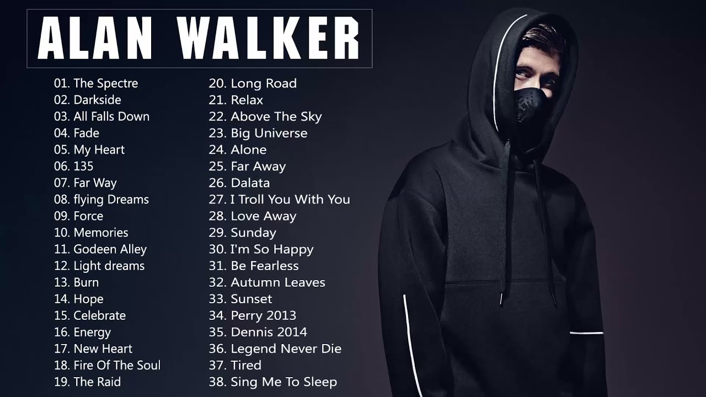

Alex Walker - A EDM Sensation
=================================

What is EDM?
----------------

EDM, also known as Electronic Dance Music. Suprisingly, EDM has been around since the 1970s.
In the 70s, it was known as disco music because it was used at disco parties. Now, we consider
discos as 'raves', renaming discos we renamed and revamped it as 'EDM'.

Who is Alan Walker?
-------------------
Alan Walker is a British-Norwegian DJ. He is known for is single "Faded" and was "certified
platinum in 14 countries". He is the 115th most streamed artist in the world on Spotify. He
recently declined continuing with NCS, a popular artist hub. Now a few of Walker's songs were
taken down due to ownership. Hopefully NCS continues to release singles for all to enjoy.

   Alan Walker [https://alanwalker.com/]_

About Faded
-----------
*Faded*, one of the most popular songs of all time. It was originally named *Fade* in 2014.
Around the time it was released, Walker started his time with NCS. In 2015 Walker released a
vocal version with extra instruments.

Walker described his song as "happy yet emotional, appropriate for both sad and/or
uplifting occasions. It's about searching for someone, something or somewhere lost. Or
just feeling lost! One of the things I like most about its lyrics is that it can be interpreted
freely by the listener."

Where can you find EDM songs?
-----------------------------

Here are some great free options for finding EDM songs
(some items might contain advertisements):

* Itunes

* Spotify

* Soundcloud

* Youtube

Popular EDM Songs
-----------------

===================  =====================  ===============
Artist               Song                   Year of Release
===================  =====================  ===============
Swedish House Mafia  Don't You Worry Child  2012
Avicii               Wake Me Up             2013
Zedd                 Clarity                2012
Darude               Sandstorm              2000
David Guetta         Titanium               2011
Daft Punk            Get Lucky              2013
Calvin Harris        Summer                 2014
===================  =====================  ===============

Youtube Links to EDM Songs!
---------------------------

* Wake Me Up - Avicii
https://www.youtube.com/watch?v=IcrbM1l_BoI

* Don't You Worry Child - Swedish House Mafia
https://www.youtube.com/watch?v=1y6smkh6c-0

* Standstorm - Darude
https://www.youtube.com/watch?v=y6120QOlsfU

* Red Lights - Tiesto
https://www.youtube.com/watch?v=CFF0mV24WCY

Sources
-------

* lafilm.edu
* alanwalker.com

.. This page was coded by Sammy Cardinal