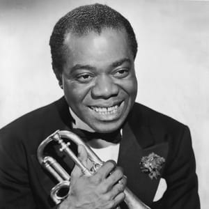

Jazz - Early and Classic
========================

Early Jazz, or more focused on "New Orleans Style" since New Orleans is
where a lot of major jazz music started, originated near the beginning of the
1900s. It originated with brass bands that would perform for parties and dances
in the early 1900s. Many of the instruments included tuba, banjo, clarinet,
saxophone, tuba, bass, guitar, drums & on the occasion, piano. This new music
took on many adaptations of popular melodies, hymns, work songs, marches, and
the Blues. This era of classic jazz even resurfaced for a bit in the 1990s.

Louis Armstrong [#f1]_

Famous Artists
--------------
New Orleans produced many wonderful jazz artists that created an influential
impact on our world and music we have today. Some of these artists include the
following:

* Louis Armstrong
* King Oliver
* Jelly Roll Morton
* Bunk Johnson
* Sidney Bechet
* Kid Ory

These are just some of the most well known musicians of the time and there were
many more.

Popular Songs
-------------
====================== =================
Song Name              Artist
====================== =================
What A Wonderful World Louis Armstrong
Loveless Love          Duke Ellington
New Orleans Stomp      King Oliver
Black and Blue         Louis Armstrong
Salt Peanuts           Charlie Parker
King Porter Stomp      Jelly Roll Morton
Ja-Da                  Bobby Hackett
Satin Doll             Duke Ellington
====================== =================

Review
------
Personally I love Jazz music as much as any other type especially the early jazz
years. I think the music itself speaks to a lot of people and has a soul of its
own when it plays. One song that sticks out to me is "What A Wonderful World" by
Louis Armstrong because I've heard it since I was a little kid. My family sang
it, I sang it, my friends even sang it and it was such an amazing piece of music
that I still love today. I'm no music expert but the early years of Jazz hit
me in such a way that it just warms my heart when I hear it.

.. [#f1] "`Louis Armstrong <https://www.biography.com/musician/louis-armstrong>`_".
   Louis Armstrong Biography. 2014. Retrieved 2021-12-06.