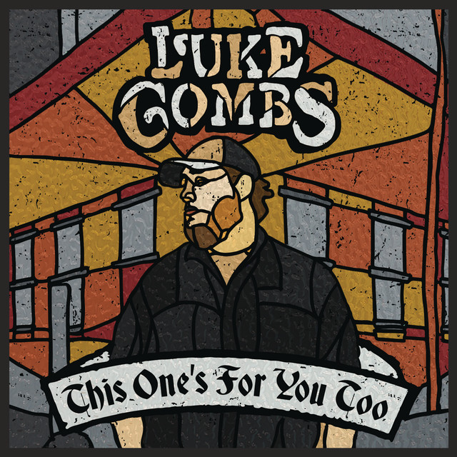

When It Rains It Pours - Luke Combs
===================================

   When It Rains It Pours [#f1]_

When It Rains It Pours is an American country song that is recorded and co-written by Luke Combs. This song was released
in June of 2017. In 2017 the song did well on many different music charts.

====================  =============
Chart(2017)           Peak Position
====================  =============
Canadadian Hot 100    54
Canada Country        1
US Billboard Hot 100  33
US Hot Country Songs  1
US Country Airplay    1
====================  =============

This song is about something similar that Luke Combs went through earlier in his life. It is written about a story
where a man's girlfriend leaves him, and then he goes on a very lucky streak.

About Luke Combs
----------------

   Luke Combs [#f2]_

Luke Albert Combs was born on March 2, 1990. He was born as well as raised in North Carolina. He attended A.C. Reynolds
High School and was involved with various vocal groups while he was there. Luke went on to attend Appalachian State
University. During his senior year at Appalachian State, Luke decided to drop out and pursue his music career with
only a month left before he would graduate. His dream of becoming a singer would come true, and he eventually released
his debut album in June of 2017. After this, Luke would go on to perform on various tours. Tours that he headlined
include the following.

* Don't Tempt Me with a Good Time Tour (2017-18)
* Beer Never Broke My Heart Tour (2019)
* What You See Is What You Get Tour (2020-21)

He was also involved in other tours in which he was not the headliner. Those include the following.

* The Devil Don't Sleep Tour (2017) with Brantley Gilbert
* High Noon Neon Tour (2018) with Jason Aldean
* Here On Earth Tour (2020) with Tim McGraw

Review
------

I personally think that this is one of Luke Combs's best works. It is a very catchy song that has a very interesting
story that goes along with it. This song is also one that gets attributed to Luke Combs a lot too. It is one of the
first works that really helped to kick start his career and get him to the place that he is today. Overall, I would
give this song a 9/10. I like pretty much everything about this song, and it always helps to put me in a good mood.

.. [#f1] "`When It Rains It Pours <https://www.lukecombs.com/>`_"
   Luke Combs. 2021. Retrieved 2021-12-7.

.. [#f2] "`Luke Combs <https://www.prevention.com/health/mental-health/a35214101/luke-combs-ocd-anxiety/>`_"
   Hearst Magazine Media, Inc. 2021. Retrieved 2021-12-7.