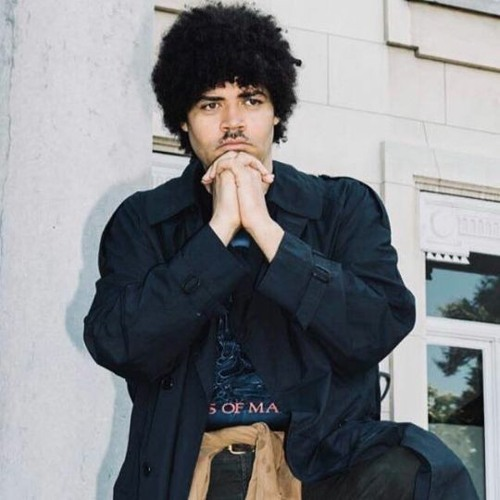
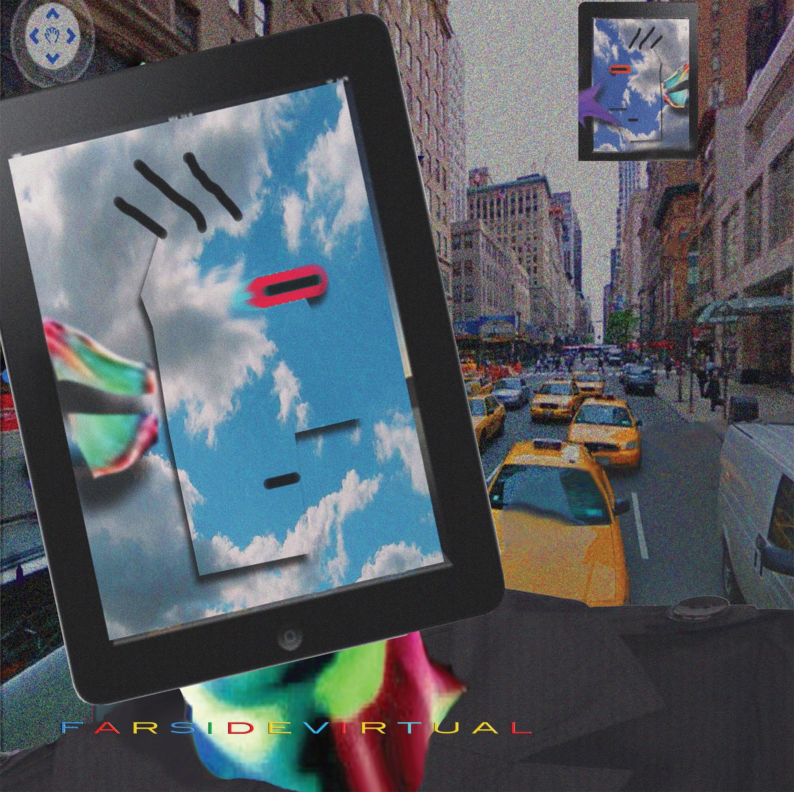

Vaporwave Corner
================
Vaporwave is a niche genre of electronic music that distinguished itself from the
rest of the chillwave section. Its uniqueness comes from the iconic visual aesthetic
it promotes; sometimes, its visual style is more recognizable than the music from
which it originated.  The pioneers of the genre Ariel Pink and James Ferraro
slowed down, Chopped, and screwed different samples of smooth Jazz, ambient street
noises, R&B, mall, and lounge music from the 1980s and 1990s. Sometimes Vaporwave’s
aesthetics and movement, in general, can be described as a commentary on modern
capitalism and the soulless glamour of late-stage capitalism. The goal is to create
a sense of nostalgia for an era that most listeners never lived in between the
consumerist culture of the 1980s to the optimistic era of the early 2000s.

Feature Artist: James Ferraro
-----------------------------

James Ferraro [#f1]_

James Ferraro is a musician, composer, producer, and visual artist. He is known
as a prolific artist whose music jumpstarted hypnagogic pop and vaporwave music
genres. Whose works often explore the glare problems of our society like climate
change and consumer culture. Ferraro’s general interest in music began at a very
young main due to his influence from his parents, of which his father was DJ, and
his mother was a singer. His career started when he met Spencer Clark, the duo
who created the Californian group The Skaters in the early 2000s.  During his time
at The Skaters, he found his style composed noise and collage sound ranging from
mystic lo-fi ethos to new age, alternative R&B, and contemporary classical with a hi-fi touch.
David Keenan described Ferraro’s music from The Wire as hypnagogic pop, which
invoke memories or nostalgia for 1980s culture. He was thrown into the spotlight
when the 2011 album Far Side Virtual was chosen as the Album of the Year by The
Wire. His Album is often credited for establishing the roots for the electronic
music microgenre known as Vaporware. Despite this honor, Ferraro constantly
refuses to be known as the father of this microgenre. Today, he recently dropped
a new album called Requiem for Recycled Earth (2019), whose goal is to address
the impact of climate change on the world by creating an all-consuming, claustrophobic
experience for the listener.

Album: Far Side Virtual
--------------------------

Far Side Virtual [#f2]_

Far Side Virtual is an album by James Ferraro, released in 2011 both digitally
and on vinyl. The album is marked as a turning point in Ferraro’s career as an
artist since it symbolizes his transition from his previous style, which focuses
on lo-fi drone music, towards more aesthetic-oriented music that later evolved
into vaporwave. Far Side Virtual deliberately uses corporate-style music,
commonly referred to as elevator music, and retro computer sounds to evoke a
sense of nostalgia towards the listener. The album was initially inspired when
Ferraro began experimenting with phone ringtones to create music. The album tackles
the concepts of hyper capitalistic culture from the 1990s and retro-futurism.
Critics describe Far Side Virtual as too bleak and pessimistic for the modern
world.

Far Side Virtual
--------------------
=======  =====================
Track    Song
=======  =====================
01          Linden Dollars
02          Global Lunch
03          Dubai Dream Tone
04          Sim
05          Bags
06          PIXARnia and the Future of Norman Rockwell
07          Palm Trees, Wi-Fi and Dream Sushi
08          Fro Yo and Cellular Bits
09          Google Poeises
10          Starbucks, Dr. Seussism, and While Your Mac is Sleeping
11          Adventures in Green Foot Printing
12          Dream On
13          Earth Minutes
14          Tomorrow's Baby of the Year
15          Condo Pets
16          Solar Panel Smile
=======  =====================

Review:
------------
I guess the reason this album is known to be a little bit unsettling is mainly
due to the eerie corporate cleanliness of it. It‘s almost like the contrasting
music for a dystopian future with a cheerful tone. Also, the track music is
reminiscent of when I was younger, and I used to play on my father’s beige
gateway computer, and the noises and beats add to that. Overall, the album
creates a sense of wonder and frightfulness that few of them make me feel. That’s
why I give it a 9/10 score based on my opinion.

.. [#f1] "`James Ferraro <https://lostmediawiki.com/Summer_Headrush_2009_Series_(lost_unreleased_James_Ferraro_albums;_2009)>`_".
   lostmediawiki. 2015. Retrieved 2021-12-06.

.. [#f2] "`Far Side Virtual <https://www.discogs.com/master/496200-James-Ferraro-Far-Side-Virtual>`_".
   Discogs James Ferraro–Far Side Virtual. 2011. Retrieved 2021-12-06.
