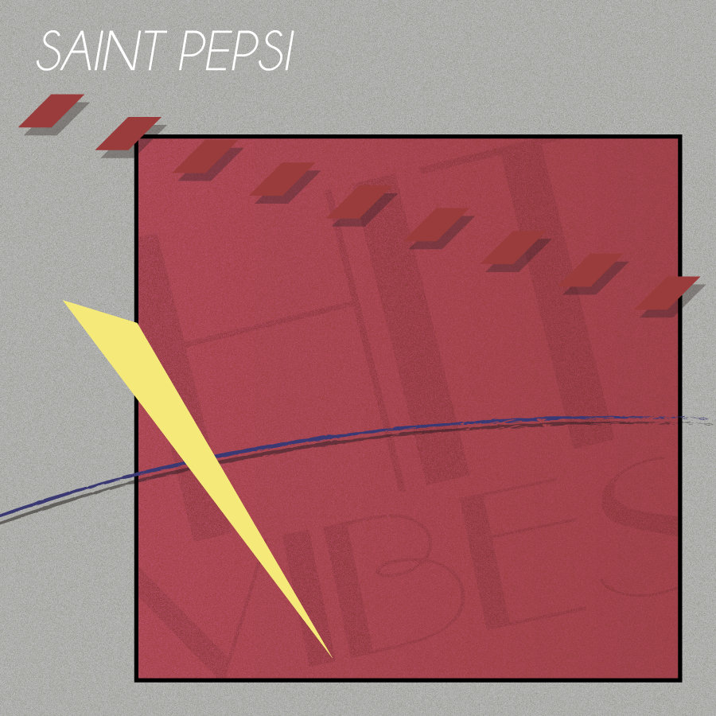

Vaporwave Corner
==================

Feature Artist: Saint Pepsi
-----------------------------

.. image:: saint_pepsi.jpg
   :width: 300px
Saint Pepsi [#f1]_

Ryan DeRobertis, better known as Saint Pepsi, is an American-born electronic
musician and singer. He is known as one of the vaporwave and future funk genre
pioneers. His musical influence began when he started writing his music at age
13 and became involved with his local high school music performance arts. His
apparent passion for music made him attend Boston College to study music. While
studying there, he started the Saint Pepsi Project in December of 2012. His first
album created and published under the new Saint Pepsi Project was Hit Vibes, which
became one of the most recognizable albums in the vaporwave genre and is often referred
to as a must-listen for anyone that wants to get started in the genre. Since his
release of Hit vibes, he's collaborated with many other artists, especially within
the vaporwave and synth space. In 2013, he dropped another album Late Night Delight
with Luxury Elite, another vaporwave artist. After six years hiatus, in 2019,
he dropped another album called Mannequin Challenge to make a comeback and was
well received by critics and the audience. To this day, he's still making music
and alluded to a possible album coming soon in 2022. The pandemic has helped him
stay focused on his work and hasn't ruled out the possibility of going on a tour
with fellow vaporwave artists next year.

Album: Hit Vibes
-------------------

Hit Vibes [#f2]_

Hit Vibes is Saint Pepsi's first album released in 2013, digitally and vinyl.
Hit Vibe was the one that put Saint Pepsi on the map when it came to Electronic
Music Artists. The album laid the ground for the genre of music commonly
referred to as future funk, a mix of 70s disco music intertwined with electronic
to give it its funky, upbeat tone. Future funk is commonly associated with the
consumerist culture of the 1990s and an appreciation of a era that most young
adults never experienced. However, h Hit Vibes experiments with the usage of
sample- and loop-based experimentation, his inclusion of random sounds,
especially jingle noises from Mario Kart 64, he's able to create an aura of
nostalgia that few albums can ever match. Critics say that Hit Vibes' 13 tracks
will make you want to stand up dance to the beat while making you contemplate about
real life.

Hit Vibes
--------------------
=======  =====================
Track    Song
=======  =====================
01          Hit Vibes
02          Have Faith
03          Better
04          Cherry Pepsi
05          Together
06          Around
07          Skylar Spence
08          Interlude
09          I Tried
10          Strawberry Lemonade
11          Fantasy
12          Miss You
13          Outro
=======  =====================

Review:
----------------
I always keep coming back to this album because of its happy and energizing beat.
Usually, I’m not fond of disco music since it’s not my thing, but Saint Pepsi can
make it palatable, even enjoyable on some occasions. I have used this music to pump
myself, whether working on an assignment or at the gym. Every time I listen to this album,
it brings me joy and motivation to get things done. As a result, I give this album
a score of 10/10 for being there, motivating me to continue.

.. [#f1] "`Saint Pepsi <https://monkeybuzz.com.br/novidades/saint-pepsi-muda-de-nome-para-skylar-spence/>`_".
   MonkeyBuzz. 2015. Retrieved 2021-12-06.

.. [#f2] "`Hit Vibes <https://www.discogs.com/master/710738-Saint-Pepsi-Hit-Vibes>`_".
   Discogs Saint Pepsi–Hit Vibes. 2013. Retrieved 2021-12-06.
